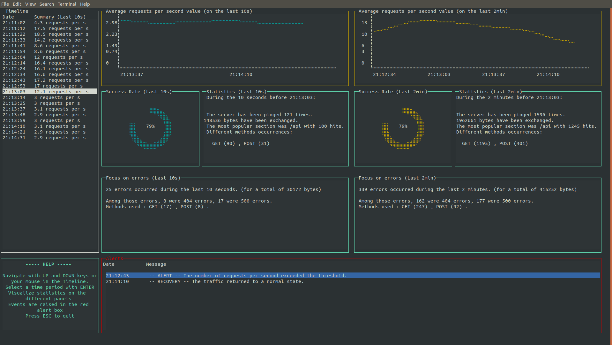

# HTTP Logs Monitor

Console program that monitors HTTP traffic.



# Table of contents
- [Architecture breakdown](#Architecture)
  * [Agent](#agent)
  * [Server](#server)
  * [Database](#Database)
  * [Watcher](#watcher)
  * [Client](#client)
- [How to use it](#usage)
  * [Install](#install)
  * [Tests](#tests)
  * [Documentation](#documentation)
- [Improvements](#improvements)

#Architecture

This program could have been realized in many different ways. This specific implementation
adopts the following point of view: at the end of the day, we would like this app to be easily scalable, 
whether it is in terms of log volume, clients or servers to monitor. This is essentially why 
it has been broken down into multiple micro services:

* An agent _(Python Script)_ that sends logs to the server
* A server _(Flask)_ that receives/stores logs and computes/sends statistics
* A database _(MySQL)_ that stores the logs temporarily and the stats permanently 
* A watcher _(Python Thread)_ that watches the database for new logs
* A client _(NodeJS)_ that calls the server to retrieve stats and display them to the user

You will find below a quick overview of each service. However, there is a lot of details that are 
only explained in the comments of each function (which/how exactly stats are computed, how old logs 
are cleaned of the database...)


##Agent

The agent takes a .csv or a .txt file that contains log lines, opens it and read it,
line by line, and sends the logs to the server every second via a POST request.  
Adopting a solution of this kind allows the agent to simulate a stream of logs that would
come, in a real-life situation, from the server that we want to monitor. It also allows 
the program to go through the file only once.

##Server

The server acts like a "platform" between all the services by exposing a REST service, 
receiving the logs from the agent and sending them to the client.  
It it written in Python because of its simplicity to compute 
calculations, format data and communicate with a database. For this last point,
it uses the library [peewee](http://docs.peewee-orm.com/en/latest/), a very simple and small 
ORM, especially to define the models, run the queries and insert into the database.

##Database

The MySQL database allows the program to keep stored the statistics and the logs in someplace
else than the memory. If we consider the situation where we deal with high volumes of logs,
we can't afford to store everything in the memory, and the database solves this issue.  
The choice to use a database also comes from the fact that not all the logs come in the right 
order to the server (for example because of the latency). This issue is reflected in the CSV sample
file where all the logs are not ordered by their timestamp. Setting up a database in the process, and therefore
not compute the stats directly from the logs received by the agent, allows the incoming logs
a certain delay (here, I decided to program the watcher to clean every second the logs older than 2 minutes:
we also don't want to store the logs permanently because the volume can be really high). The
statistics, on the other hand, get stored permanently so the client can access them at any time.

##Watcher

The watcher is a Python thread that watches every new second the database for 
incoming logs from the agent.
If new logs get inserted, then the watchers launches an instance of another Thread called
StatsComputer which, as its name states it, computes statistics. It performs the calculations
every 10 seconds, on the last 10 seconds and last 
2 minutes logs (based of course on the logs timestamps).  
When it has been 2 minutes that the DB didn't receive any new log, the StatsComputer is shut
down and the watcher resumes its activity.

##Client

 The client is a pretty straightforward NodeJS interface. I used it rather than Python because
 I found the console library much more complete, and [axios](https://www.npmjs.com/package/axios) is
 a very useful library to make API calls.
 It is basically composed by 3 different Objects: DataSender, DataRetriever and Display.
 As the DataSender and DataRetriever communicate with the server, Display is the object that will
 contain all the different components of the interface. It is build with a JavaScript library 
 called [blessed](https://www.npmjs.com/package/blessed)
 
 
#Usage

You will need to install [Python (>=3.6)](https://www.python.org/) along with pip, [Node.js](https://nodejs.org), 
[NPM](https://www.npmjs.com/) and docker-compose to run the app.

##Install
To mount the database image, run the following code in the `server/` directory:
```bash
sudo docker-compose up
```
Then, you will have to connect to the database to create a schema `monitor` with the credentials in `server/monitor/database.py` (unfortunately not doable with peewee).  
To start the server, run the following code in the `server/` directory (you can chose to use a `venv` to install the requirements
 in it, it is very useful):
```bash
pip install -r requirements.txt
python run.py
```
Then, in the same folder, start the watcher:
```bash
python threads.py
```
You can open the client in the `client/` directory:
```bash
npm install
node app.js
```
You're are now in the interface. You can finally run the agent that'll send the logs to the server, run in `client/` directory:
```bash
python agent.py
```
You can replace the log file by replacing it in the `agent/` directory.

##Tests
The alerting logic has been successfully tested.  
You can find the unit test file in `server/monitor/test/agent.py`

##Documentation
Although there is no proper documentation, all the important functions and classes have been commented.

#Improvements

Here are some of the huge improvements I can think of:
* **Scalability Logic**: As it has been said in the beginning of this document, this whole app has been thinked
to answer to scalability problematics. The fact that the app is divided in many micro services paves the way
to improvements, such as adding user ID and agent ID, so that that we are easily able to listen in the same time 
to several agents from several clients at the same time.

* **More Complete Interface**: If we want to be able to monitor several servers at the same time, we want to be 
able to switch between the different servers pages. That is one of the improvement we can think of about the
UI, which remain very limited with blessed, as well as : a way to select several timeframes at the same time 
to cross-check stats, or delete entire batches of stats at once, a more user friendly way to select the timeframe, 
more complete widgets... All of these could easily be solved by the choice of a web interface.

* **Other solution to store the logs**: In our case we made the choice to store the logs with a lifetime of 2 minutes.
We can think of other solutions, such as storing only the errors but longer, or more generally store only one type of 
logs for a given period of time, more or less important (depending maybe on the pricing solution our client subscribed to!)

* **Alerts**: The alerts are great here but why not push the alerting logic a little further, like sending emails when an alert is crossed,
or slack messages, or just a simple push notification... Concerning the threshold, the value can already be inputted by the user,
but we could think about more customization, like setting the threshold on another parameter, like the average number
of 400 errors on a given URL.

* **Timeframes**: You may have noticed that the timeframes are not always exactly 10 seconds long all the time. That's because of the
way our thread work : they sleep exactly 10s between 2 stats computation, and this computation time takes a few milliseconds. 

 Some more general remarks:
 
 * Probably the biggest practical issue I've faced : the use of a docker mounted database requires to create a SQL schema manually. An SQLite
 DB should solve this issue but I'm not really sure about the performances nor the scalability of this solution.
 * It would be nice if all the stats get loaded on client login. It would give even more sense to the database, but I didn't have the time to finish it
 * The agent would be better working in a thread instead of a while loop, it would be way cleaner
 * It would be better to have more tests to make the code more maintainable
 * It might be a good idea to parse the logs directly at the agent level, so that different agents can all 
 send already properly formatted logs to the server
 * Same idea with the client, the server should compute a little bit more the stats so that the client just need to fetch them and display them
 

